## 详细使用说明


### 0、为什么使用sublime

对于写算法题，对ide要求不高，只要有语法高亮和格式化就行

- idea 系类太吃内存
- vscode 会因为安装各种插件导致也吃内存，另外就是 vscode 经常出现莫名的更新提示
- 其他没怎么了解

sublime 刚刚好（请前提是使用破解版的没用弹窗提示的） 轻量，预览快


### 1、卸载电脑管家

如果是 win 系列系统，微软会在系统中默认安装电脑管家，这个会经常检测各种程序安全性，吃掉内存，严重点会卡死运行的程序


### 2、安装并使用sublime

1、进入目录 sublime-config 这个目录，解压里面的`sublime-7z` 文件，这个是破解版的，如果不想麻烦，可以自己到官网下载

   注：这个解压文件可以自己移动到想解压的目录


2、解压完毕后打开sublime,打开资源包，按照 `设置->浏览资源包->进入资源包目录->返回资源包的上一级目录`

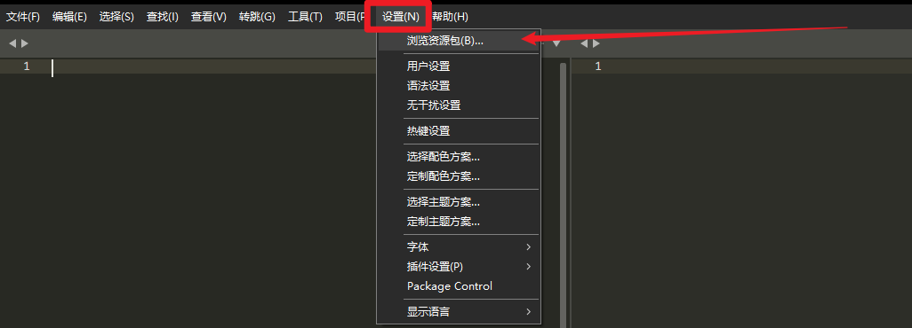


3、安装资源包

回到从git上下载的配置目录，打开`sublime-config`目录


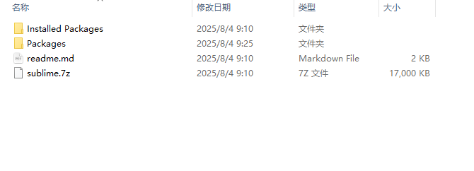


将上面这两个文件直接拖入到之前打开的资源包目录上一级目录中


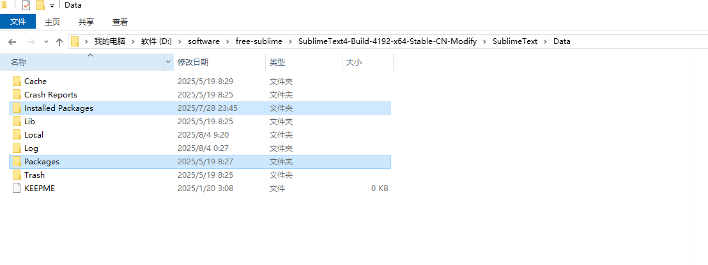


到这里基本上就能正常使用了


### 如何写算法题

关闭sublime后重启 （这边建议发送一份快捷方式到桌面）

#### 测试

先测试一下能否正常使用

在桌面新建一个目录 比如 alog,拖入到 sublime 中打开

在这个目录中新建一个文件，比如 A.java，写入下面内容

```java

public class A {
    public static void main(String[] args) {
        System.out.println(System.getProperty("java.version"));
    }
}
```

> 运行


按下 `ctrl+alt+b` 运行，结果如下图

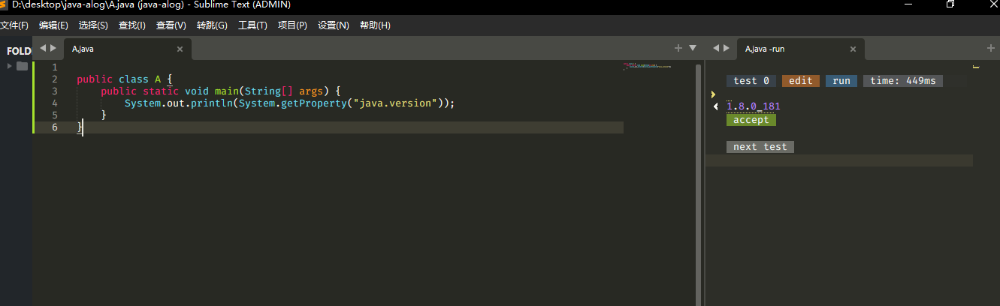


#### 如何在sublime中用c++ ？

**注：如果不使用c++请忽略这段内容**

sublime 默认自带了一些语法提示，但是可能还不够，不能提前检测报错信息

因此需要安装`clangd`

如果安装了请跳过

你可以参考下面步骤

1. 下载clangd和c++解释器 `https://github.com/mstorsjo/llvm-mingw/releases/download/20250402/llvm-mingw-20250402-msvcrt-x86_64.zip
`

2、解压后配置环境变量


```txt
编辑系统变量

CLAND_HOME
D:\environment\cpp\llvm-mingw

添加到path中

%CLAND_HOME%\bin\


```
**注意`D:\environment\cpp\llvm-mingw`是刚刚下载的解压路径**

图示

编辑系统变量

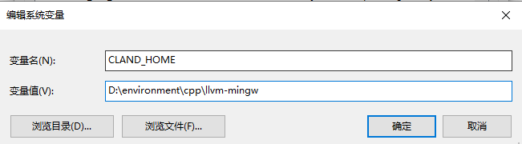


添加到 path中

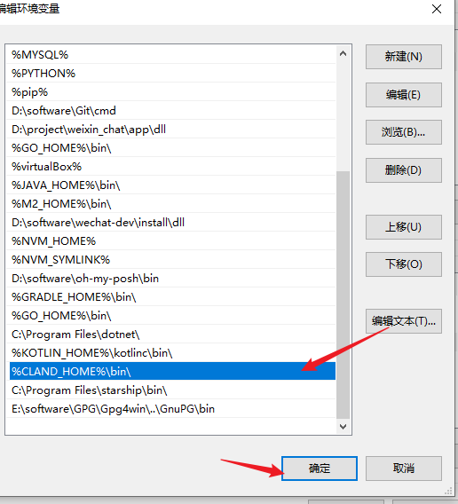


检测c++解释器是否安装完毕

```shell
C:\Users\Administrator>clang++ --version
clang version 20.1.2 (https://github.com/llvm/llvm-project.git 58df0ef89dd64126512e4ee27b4ac3fd8ddf6247)
Target: x86_64-w64-windows-gnu
Thread model: posix
InstalledDir: D:/environment/cpp/llvm-mingw/bin
Configuration file: D:/environment/cpp/llvm-mingw/bin/x86_64-w64-windows-gnu.cfg

```

**如果没生效建议重启电脑**


到这里c++的解释器和clangd就安装成功了


测试c++能不能生效

打开sublime刚刚的目录，新建一个A.cpp 文件

```c++
#include<bits/stdc++.h>

int main() {
    int a,b;
    std::cin >> a>> b;
    std::cout << (a + b) << "\n";
    return 0;
}
```

按 `ctrl+alt+b` 运行

在右侧输入想要输入的数字

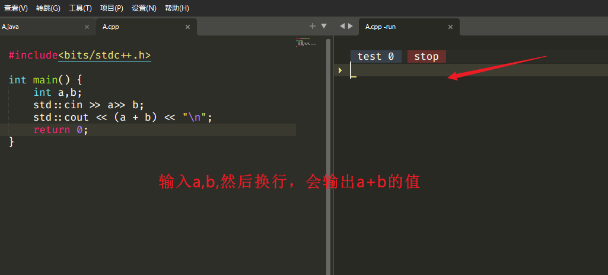


输出结果如下

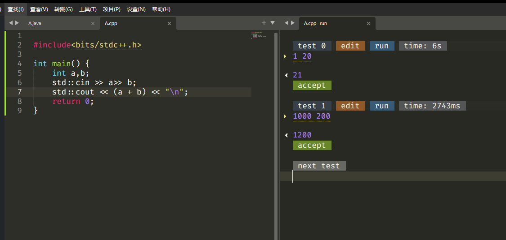

如果上面操作都能正常运行，说明之前安装成功。


### 4 、浏览器安装插件`cph`


如果用来写题，这样还是太麻烦，想要自己处理输入输出结果的案例，这个时候需要浏览器安装 cph 来解析案例了

回到刚刚下载的目录 `my-sublime-template\cph`

里面有两个版本的 cph ，如果是火狐请使用带有firefox的


以Edge浏览器为例

解压`Competitive Companion 2.57.1.7z`

打开刚刚解压的

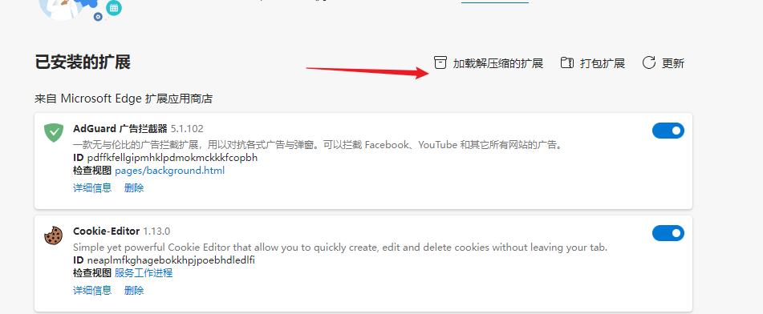

安装成功后可以看到这个

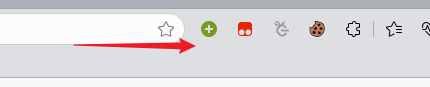

当然你可以到[github](https://github.com/jmerle/competitive-companion)上下载最新的


### 5、sublime 使用解析工具


1、打开题面

以今天灵茶[每日一题](https://codeforces.com/problemset/problem/1101/G)示例

2、回到 sublime 

鼠标右键打开下面插件的解析方式

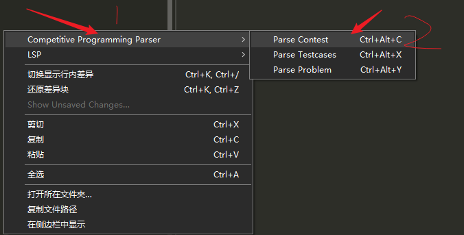

点击你想要的解析方式，比如我这里选择 解析为 ` parse problme`

3、点击浏览器+号

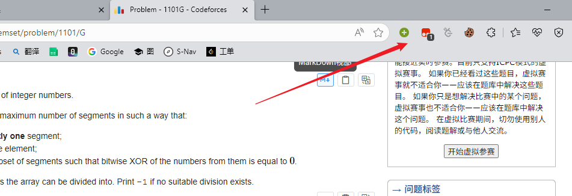


4、sublime会监听到消息，并成功创建文件模板和输入输出案例

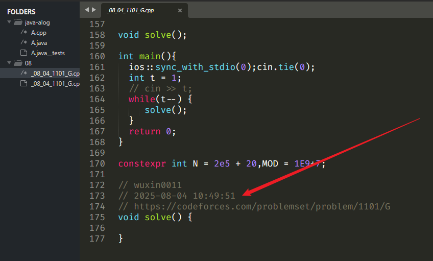


> 文件模板如何创建 ？

回到 `my-sublime-template\template_code`

将上面目录拖入到D盘就行

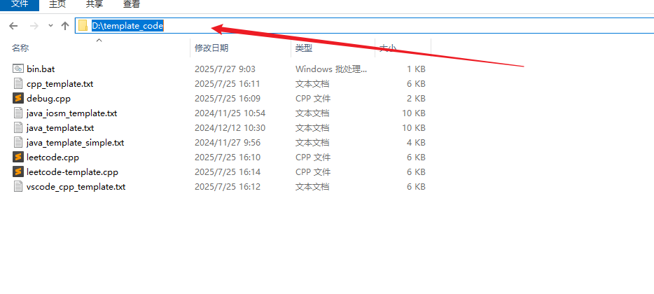

如果要详细了解配置信息请参考这里 [模板参数说明](./sublime-config/readme.md)

打开设置

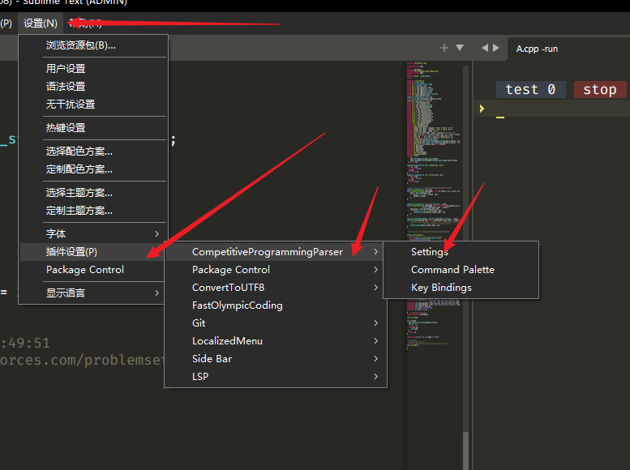


你主要修改是自己语言配置
如果是c++不需要修改,如果是java，请修改这个配置

.java

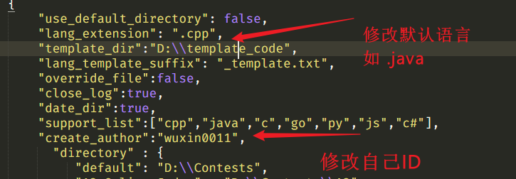


到这里基本上就结束了，更多基本用法请看 [readme.md](./readme.md)